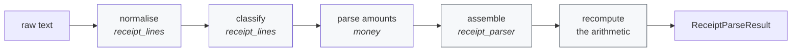

# Architecture

This document explains **why** the standalone tool is shaped the way it is. For what it does and
how to run it, see [README.md](README.md).

---

## The shape

```
                ┌──────────────┐   ┌──────────────┐   ┌──────────────┐
                │   app.py     │   │   cli.py     │   │mcp_server.py │
   entry        │  Gradio UI   │   │  terminal    │   │  5 MCP tools │
   points       └──────┬───────┘   └──────┬───────┘   └──────┬───────┘
                       └──────────────────┼──────────────────┘
                                          │
            ┌─────────────────────────────┴─────────────────────────────┐
            │                     compliance_tools/                     │
   engine   │  policy_checker · receipt_parser · category_classifier    │
            │       duplicate_detector · report_summariser              │
            │       schemas · policy · llm (Protocol only)              │
            │            depends on: pydantic. that's all.              │
            └─────────────────────────────┬─────────────────────────────┘
                                          │ injected by callers;
                                          │ never imported by the engine
                               ┌──────────┴──────────┐
   storage                     │      local_db/      │
                               │  SQLite · stdlib    │
                               └─────────────────────┘
```

Three layers, one direction. Entry points may use the engine and the store; the engine may use
neither the store nor any entry point. [tests/test_offline_guarantee.py](tests/test_offline_guarantee.py)
enforces this by parsing the AST of every published file.

### Why the engine depends on nothing

`compliance_tools/` imports `pydantic` and the standard library. Not the database, not MCP, not
Gradio, not an HTTP client.

That constraint buys three things:

1. **It is embeddable.** `from compliance_tools import check_policy` works in any project without
   dragging in a web framework or a database.
2. **Tests are fast and hermetic.** No fixtures to stand up, no I/O to stub. The full suite runs in
   about fifteen seconds.
3. **The boundary is obvious.** When a rule needs data, it takes it as an argument. `detect_duplicates`
   receives its history; it does not know SQLite exists. Swapping in Postgres, an API, or a literal
   list requires no change to the engine.

---

## The determinism boundary

This is the central design decision, and everything else follows from it.

**Rules and arithmetic are plain Python. A model, if present, only writes prose.**

| Concern | Who decides | Why |
|---|---|---|
| Does this expense break policy? | Python | An audit will ask *which rule*, and the answer must be the same next year |
| Do these line items add up? | Python | Recomputed from the extracted numbers, never copied from an answer |
| Is this a duplicate? | Python | A blocked reimbursement needs a reason a human can check |
| What category is this? | Keywords, or a model — validated against the enum | A hallucinated category cannot escape |
| How should the summary read? | A model, or a template | Prose is the one place a model can't do damage |

The three LLM-assisted tools (`parse_receipt`, `classify_category`, `summarise_report`) each validate
the response and fall through to a deterministic path when it is unusable. Adding a model can improve
results; it cannot break correctness. `tests/test_report_summariser.py::test_llm_cannot_change_the_numbers`
and `tests/test_category_classifier.py::test_hallucinated_category_cannot_escape_the_enum` pin this down.

The model seam is a `Protocol`, not a base class — so bringing your own model needs no SDK, no
registration, and no inheritance, and this repository ships no provider dependency at all.

---

## How the receipt parser works

The receipt parser is the only component that has to cope with input nobody controls, and
it was the source of every parsing bug this project has had. All of them shared a cause:
it was a stack of independent regexes, each scanning the whole document, each able to match
text another had already claimed.

| Bug | Cause |
|---|---|
| `Tax (8.625%)  3.88` reported tax of 8.625 | The tax regex reached the rate before the charge |
| `2 nights @ $210, Tax $42` gave a description ending in a comma | The price pattern swallowed the list separator |
| `Postcard  10.00` vanished from the receipt | A label test matched "card" inside a purchase name |

Each fix was local, and each left the next one possible. So the parser is now a pipeline
where **every line gets exactly one interpretation**:



**normalise** folds unicode whitespace — non-breaking and narrow spaces pour out of PDF
text layers and defeat every column rule downstream — and splits a single-line receipt on
the commas that separate facts rather than group thousands. That last step means the
one-line shape and the printed shape reach the classifier looking the same, so there is no
second code path for it.

**classify** assigns each line one `LineKind`, in a fixed order that *is* the specification:

1. A **label** at the start of the line, ending on a word boundary — `Total`, `Tax`, `VISA`.
   First, because a totals row is otherwise indistinguishable from a purchase.
2. A **date or time**.
3. A **purchase** — description, gutter, amount. Quantity pricing (`2 nights @ $210`) is
   recognised here rather than as a later fallback, so it cannot be misread as a `$210` line.
4. Everything else is **noise**, and the first noise line without an amount is the merchant.

**parse amounts** resolves locale ambiguity in one place, against a table of cases, rather
than inside whichever regex matched first — see [compliance_tools/money.py](compliance_tools/money.py).

**assemble** reduces the classified lines into a result, and the arithmetic is then
recomputed from scratch, exactly as before.

The practical gain is that behaviour is now inspectable and independently testable:

```python
>>> from compliance_tools.receipt_lines import scan
>>> for line in scan(receipt_text):
...     print(line)
[  0] merchant   'NOODLE HOUSE'
[  1] date       '2026-06-01  12:47'
[  2] item       'Pad Thai (x2)          18.00' = 18.00
[  5] tax        'Tax (8.625%)            3.88' = 3.88
[  6] total      'Total                  48.88' = 48.88
```

When a receipt parses oddly, that output says why. Previously the only way to find out was
to reason about which of several regexes had won.

### What the parser deliberately does not do

* **It is not OCR.** It reads a text layer or a string. A scanned image without one yields
  nothing; run OCR first and pass the output in.
* **It does not correct characters.** A misread `O` for `0` stays wrong. Silently rewriting
  digits in a financial document would be a worse failure than reporting one.
* **A line starting with a totals keyword is a totals row.** `Total Recall DVD  10.00` is
  read as a total. The alternative — looser label matching — silently dropped real
  purchases, and a wrong total is easier to notice than a missing line.
* **Locale is inferred per amount, not per document.** `1,234` is 1234 and `1.234` is
  1.234. A document-level locale guess would be more accurate on consistent input and
  much worse on mixed input.

### Money is `Decimal`, everywhere

Never `float`. Amounts cross the schema boundary as `Decimal`, are stored in SQLite as `TEXT`, and
are summed with `Decimal`. A reconciliation tool that drifts by a cent is worse than no tool, and
`SUM(CAST(amount AS REAL))` would reintroduce exactly the drift the `TEXT` column exists to prevent.

---

## Why SQLite is auto-created and seeded

The database is created, migrated and seeded the first time anything asks for it. Nothing is
committed to git.

**Why persistence exists at all.** One tool genuinely needs it: the Duplicate Detector has to compare
an expense against ones it has already seen. Everything else the store does — the tool audit trail,
report aggregation — falls out of having that history available. Persistence was added because a
feature required it, not because applications usually have databases.

**Why it auto-creates.** The alternative is a setup step, and a setup step is the thing most likely to
stop someone evaluating a tool. `git clone && pip install && python app.py` has to work, and a
migration command in between would break that promise for no benefit — the schema is two tables in
[local_db/schema.sql](local_db/schema.sql) and `CREATE TABLE IF NOT EXISTS` is idempotent.

**Why it seeds.** An empty duplicate detector is indistinguishable from a broken one. The seed data
includes a deliberate exact-duplicate pair, so the first thing a new user does actually finds
something. Seeding only happens when the database is new or empty — an existing one is never touched.

**Why the binary is not committed.** A `.db` file in git means diff noise on every run, merge
conflicts nobody can resolve, and a file that drifts from the schema that generates it. Committing it
would also invite people to edit it directly rather than through the store. It is generated state, so
it lives in [.gitignore](.gitignore); delete it any time and it rebuilds.

**Why the default path moves when installed.** In a checkout, the database sits at
`local_db/sqlite.db` — self-contained and obvious. Installed as a package, `local_db/` lives inside
`site-packages`, which may be read-only and is the wrong home for user data, so it falls back to the
platform's per-user data directory. `EXPENSE_DB_PATH` overrides both.

**No ORM, no migration framework.** Two tables and the standard library's `sqlite3`. SQLAlchemy and
Alembic would be more dependencies and more concepts than the problem has.

---

## Why no `.env` is required

The standalone tool has **zero required configuration**. There is no `.env`, no `.env.example`, and
no `python-dotenv` dependency.

Every option has a working default, so the tool runs correctly with an empty environment:

| Variable | Default |
|---|---|
| `EXPENSE_DB_PATH` | `local_db/sqlite.db`, or a per-user data directory when installed |
| `EXPENSE_POLICY_PATH` | the packaged `compliance_tools/baseline_policy.json` |
| `EXPENSE_RECEIPT_DIR` | unset — file reads are unconfined |
| `EXPENSE_PERSIST` | `1` |
| `EXPENSE_LOG_LEVEL` | `INFO` |
| `GRADIO_SERVER_NAME` / `GRADIO_SERVER_PORT` | `127.0.0.1` / `7860` |

Shipping an `.env.example` that nothing reads would be worse than shipping nothing: it implies
configuration is needed, and the first thing a new user would do is try to fill it in. The variables
above are documented in [README.md](README.md) and read directly from the environment.

Policy is the one thing teams genuinely need to change, and it is **data, not configuration** — a
JSON file you can version in git and diff in a pull request. That is a better fit than environment
variables, which can't express a per-category limit table.

---

## Why the Azure code is isolated rather than deleted

[enterprise/](enterprise/) holds the multi-tenant platform this tool was extracted from: FastAPI with
Entra ID SSO and RBAC, Service Bus workers, an AI Search RAG pipeline, a Next.js portal, and Bicep
infrastructure.

**Why keep it.** It works, it represents real design decisions, and someone evaluating this tool for
an organisation will reasonably ask "what does this look like at scale?" Deleting it would throw away
that answer. It is also the provenance of the five tools — `enterprise/docs/SCOPING.md` is cited by
section throughout that code.

**Why isolate it completely.** An open-source tool that quietly needs a cloud account is not an
open-source tool. So the separation is enforced, not merely intended:

- Nothing in `enterprise/` is imported by any published module.
- It is not installed by `requirements.txt` or declared in `pyproject.toml`.
- It is excluded from the style lint and the formatter.
- [tests/test_offline_guarantee.py](tests/test_offline_guarantee.py) fails the build if an Azure
  import, a cloud SDK, an `AZURE_*` variable, an auth token, or an HTTP client appears in a published
  file.

That last point is the important one. With both codebases in the same repository, leakage is a
question of when, not whether — so it is a test, not a convention.

**Why the five tools were rewritten rather than shared.** `enterprise/core-engine/` carries an Azure
extra and enterprise workflow enums. Sharing it would have made the published package depend on a
package with an Azure code path. `compliance_tools/` is a clean reimplementation that depends only on
`pydantic`.

`enterprise/` is still checked for real defects — CI runs `ruff check enterprise --select F --isolated`,
catching unused imports, dead locals and undefined names while ignoring style. Restyling 200+ archived
files would be churn; letting genuine defects rot would be negligence.

---

## Why exactly five MCP tools

The enterprise MCP server exposes **61** tools. This one exposes **5**, and
[tests/test_mcp_server.py](tests/test_mcp_server.py) fails if that number changes.

A tool list is a prompt. Every tool is described to the model on every call, and the cost of a large
surface is paid continuously: more tokens, more plausible-but-wrong choices, and a model that has to
reason about `approve_sheet` versus `finance_approve_sheet` before it can do anything useful. The 56
tools that were removed are adapters over an authenticated REST API — they need a running backend, a
bearer token and an RBAC context, none of which exist here.

What remains is the part that is genuinely useful without a backend: five analysis tools that take
data in and return a verdict.

Two of them read the local database so the agent does not have to carry state — `duplicate_detector`
compares against stored history by default, and `report_summariser` aggregates stored items when
given none. That is the payoff for having persistence at all.

Design choices worth keeping if you extend the server:

- **Every parameter is described.** The schema is the model's only documentation.
- **Structured inputs are typed** (`list[HistoricalLineItem]`, not `list[dict]`), so the model gets a
  real schema instead of an opaque object.
- **No clock override.** `check_policy` accepts an injectable `today` for testing; the MCP tool does
  not expose it. A caller that can set "today" can decide whether its own expense is future-dated.
- **Logs go to stderr.** On stdio transport, anything on stdout corrupts the JSON-RPC stream.
- **The audit trail never breaks a call.** A failed bookkeeping write is logged, not raised.

---

## How to use the enterprise features anyway

The two are independent; running one does not involve the other.

- **The standalone tool** — `pip install -r requirements.txt`, then `python app.py`. No account.
- **The enterprise platform** — an Azure subscription and a Bicep deployment. See
  [DEPLOYMENT.md](DEPLOYMENT.md), or [enterprise/README.md](enterprise/README.md) for the layout.

There is no migration path between them and no shared configuration, which is deliberate: a shared
config file is how a "runs offline" tool ends up needing a cloud account.

If you want the enterprise behaviour without Azure, the useful seam is the LLM `Protocol` in
[compliance_tools/llm.py](compliance_tools/llm.py). Point it at any model you like — including a local
one — and the three LLM-assisted tools will use it, with the deterministic fallbacks still in place.

---

## Testing strategy

The suite covers each tool's happy path, its edge cases, its degenerate input, and — for the
LLM-assisted ones — what happens when a model returns rubbish. Beyond that, four suites exist to stop
specific classes of regression:

| Suite | Stops |
|---|---|
| [test_offline_guarantee.py](tests/test_offline_guarantee.py) | Cloud dependencies creeping back in from `enterprise/` |
| [test_mcp_server.py](tests/test_mcp_server.py) | The tool surface growing past five, or a clock override reappearing |
| [test_app.py](tests/test_app.py) | The demo breaking — it launches the real server, because `build_ui()` succeeding does not mean `launch()` will |
| [test_local_db.py](tests/test_local_db.py) | Money precision loss, and an installed package writing into `site-packages` |

Every test runs against an isolated temporary database. Nothing touches `local_db/sqlite.db`.
