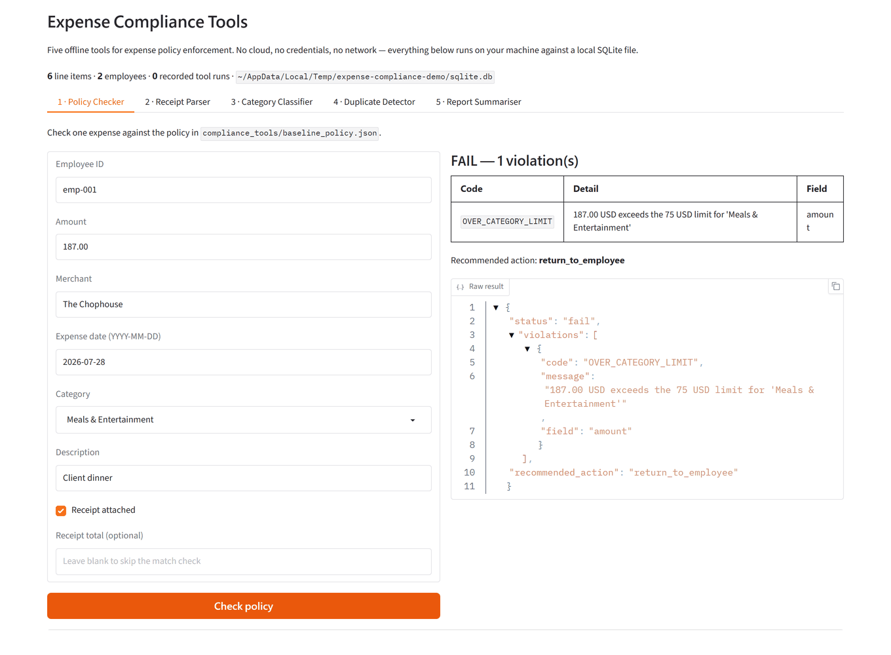
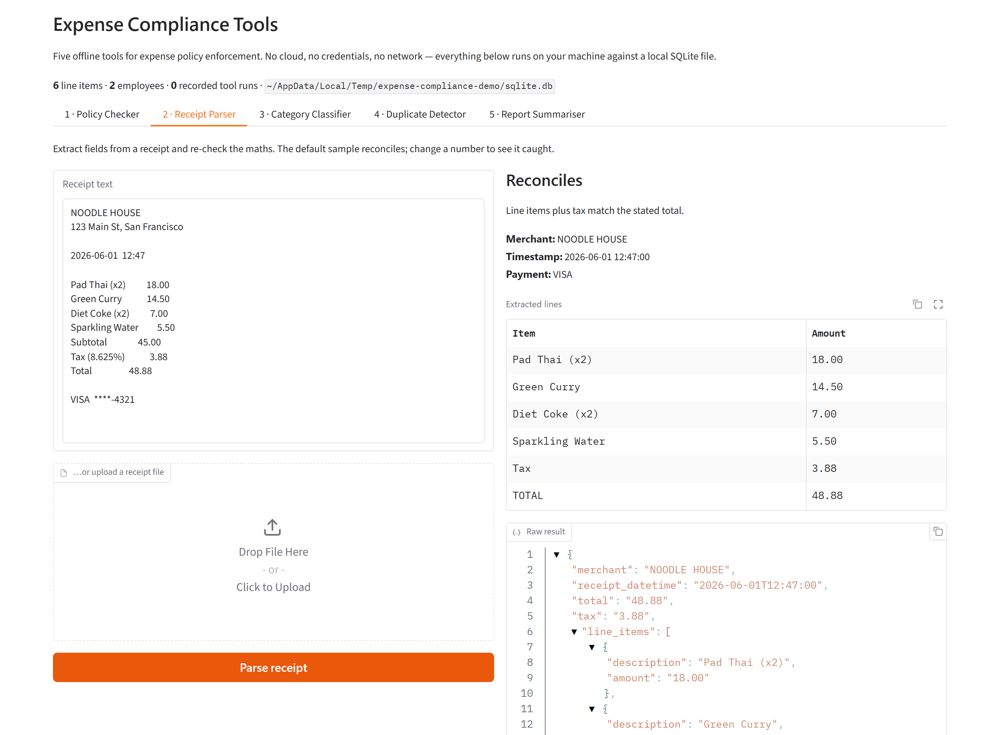
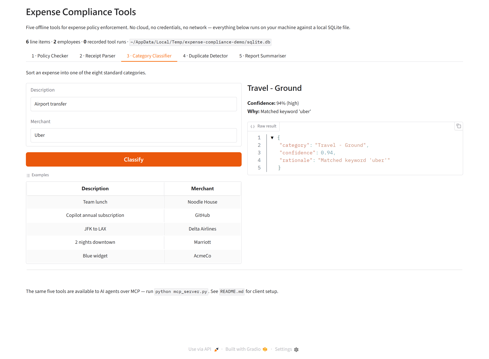
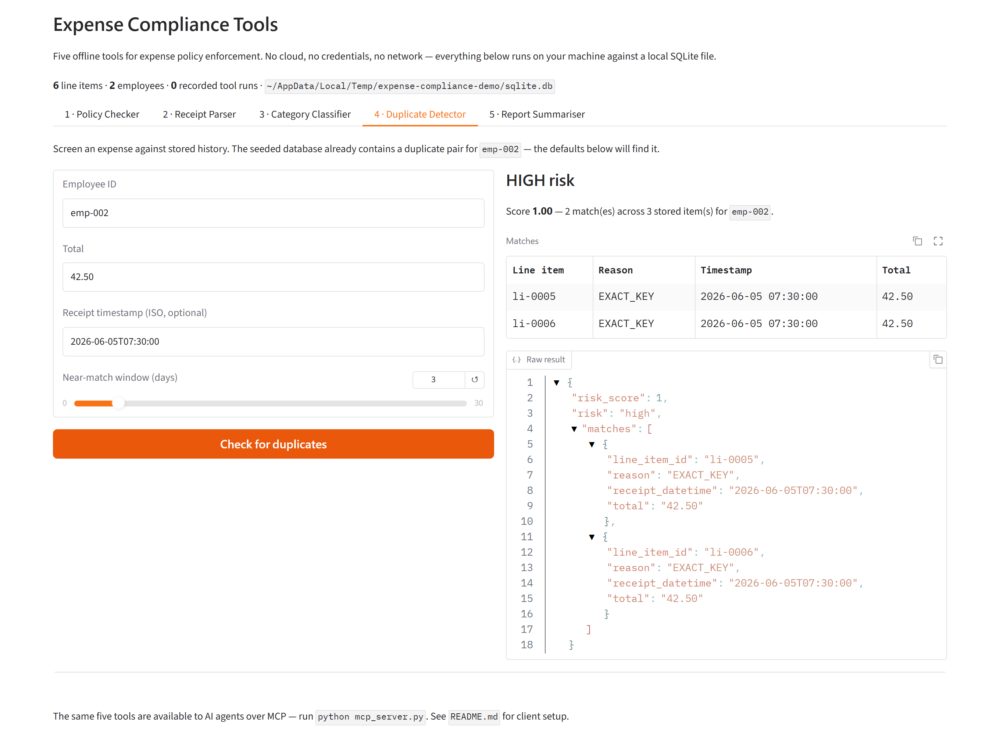
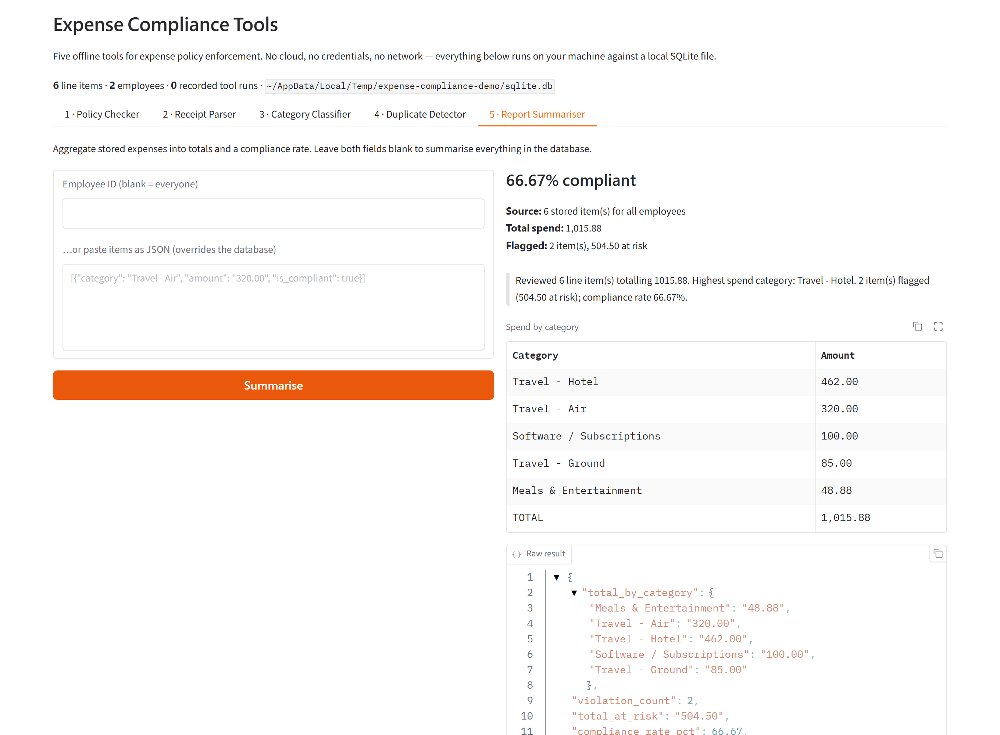
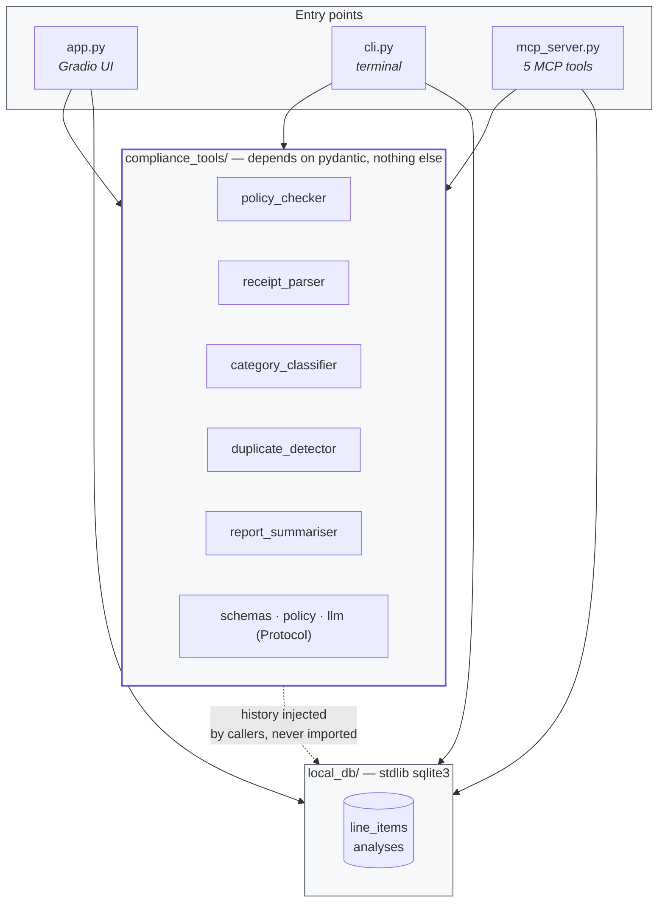

<div align="center">

# Expense Compliance Tools

**Five offline tools that check expense claims against policy — and expose them to AI agents over MCP.**

No cloud account. No API keys. No network. Clone it and it runs.

[](https://github.com/AuxiLabs-Auxiliobits/auxilab-mcp-expense-mgmt/actions/workflows/ci.yml)
[](#testing)
[](https://www.python.org/downloads/)
[](LICENSE)
[](https://github.com/astral-sh/ruff)
[](#use-it-from-an-ai-agent-mcp)
[](#the-offline-guarantee)

[Quick start](#quick-start) · [The five tools](#the-five-tools) · [MCP setup](#use-it-from-an-ai-agent-mcp) · [Architecture](ARCHITECTURE.md) · [Limitations](#known-limitations) · [FAQ](#faq)

*An AuxiLab MCP Hackathon project by team **MCP Mavericks** — Ankit Kumar · Parteek*



</div>

---

## Quick start

```bash
git clone https://github.com/AuxiLabs-Auxiliobits/auxilab-mcp-expense-mgmt.git
cd auxilab-mcp-expense-mgmt
pip install -r requirements.txt && python app.py
```

That opens **http://127.0.0.1:7860** with all five tools ready to use. There is no step four —
no account to create, no key to paste, no `.env` to fill in, no database to migrate.

Prefer the terminal, or on a headless box?

```bash
python cli.py          # runs all five tools and prints the results
python mcp_server.py   # serves the five tools to an AI agent over MCP
```

<details>
<summary><b>What <code>python cli.py</code> prints</b></summary>

```
------------------------------------------------------------------------
  1. Policy Checker  (deterministic, no model)
------------------------------------------------------------------------
  [ok]   Compliant team lunch, receipt attached
  [flag] Dinner over the $75 category cap
          OVER_CATEGORY_LIMIT: 187.00 USD exceeds the 75 USD limit for 'Meals & Entertainment'
  [flag] Prohibited category
          PROHIBITED_CATEGORY: Category 'Client Entertainment' is not reimbursable
  [flag] Receipt missing above the $25 threshold
          RECEIPT_REQUIRED: A receipt is required for expenses over 25 USD
  [flag] Entered amount disagrees with the receipt
          AMOUNT_MISMATCH: Entered amount 50.00 does not match the parsed receipt total 47.50

------------------------------------------------------------------------
  2. Receipt Parser  (extraction + arithmetic verification)
------------------------------------------------------------------------
  Merchant   : NOODLE HOUSE
  Timestamp  : 2026-06-01 12:47:00
  Total      : 48.88
  [ok]   Reconciles (items + tax == total, delta=0)
  [flag] Same receipt with the total altered to 58.88 -> caught, off by 10.00

------------------------------------------------------------------------
  4. Duplicate Detector  (screened against local SQLite history)
------------------------------------------------------------------------
  Stored history for emp-002: 3 item(s)
  [flag] Re-submitting the $42.50 Uber ride -> risk=high (score 1.0)
          EXACT_KEY against li-0005 (2026-06-05 07:30:00, 42.50)
  [ok]   A genuinely new $19.99 expense -> risk=none
```

</details>

---

## Why this exists

Expense compliance is mostly arithmetic and rule-checking, and both should be **reproducible**.
If a claim is rejected, someone will eventually ask why — and "the model said so" is not an answer
that survives an audit.

So the split here is deliberate:

- **Rules and arithmetic are plain Python.** The policy checker, the duplicate detector, and every
  number in the report summariser are deterministic. Same input, same verdict, forever.
- **A language model is optional, and only ever does language.** It can phrase a summary or read an
  awkward receipt layout, but it is handed the finished figures as facts. It cannot change a total,
  invent a category outside the enum, or make a receipt reconcile that doesn't.

The practical payoff is that the whole thing runs offline with zero credentials — which is also what
makes it easy to test, easy to embed, and easy to trust.

## Features

|  | |
|---|---|
| **Zero setup** | No account, no key, no `.env`, no Docker. `pip install` then run. |
| **Fully offline** | No outbound network call anywhere in the package — [enforced by a test](#the-offline-guarantee). |
| **Four dependencies** | `pydantic`, `mcp`, `gradio`, `pypdf` — three if you skip the browser demo. Prebuilt wheels on every major platform, so no compiler is needed. |
| **Exact arithmetic** | Money is `Decimal` end to end. No float drift, ever. |
| **MCP-native** | Five tools with fully described, typed schemas. Ready for Claude Desktop. |
| **Local persistence** | SQLite via the standard library. Created and seeded on first run. |
| **Bring your own policy** | Rules are JSON you version in git and diff in a pull request. |
| **Bring your own model** | Any object with a `complete()` method. No provider SDK shipped. |
| **Well tested** | 96% coverage across Python 3.11, 3.12 and 3.13. |

---

## The five tools

| # | Tool | What it does | Uses a model? |
|---|------|--------------|---------------|
| 1 | **Policy Checker** | Validates one expense against caps, prohibited categories, receipt rules and the claim window | Never |
| 2 | **Receipt Parser** | Extracts merchant, total, tax and line items — then re-checks the arithmetic | Optional |
| 3 | **Category Classifier** | Sorts an expense into one of eight categories with a confidence score | Optional |
| 4 | **Duplicate Detector** | Screens a claim against previously seen ones | Never |
| 5 | **Report Summariser** | Aggregates spend, violations and a compliance rate, with a narrative | Optional (prose only) |

### 1. Policy Checker


Returns a status, the specific violations, and what the caller should do about it.

```python
from datetime import date
from decimal import Decimal
from compliance_tools import check_policy, load_policy
from compliance_tools.schemas import Category, LineItemInput

result = check_policy(
    LineItemInput(
        employee_id="emp-001",
        category=Category.MEALS_ENTERTAINMENT,
        amount=Decimal("187.00"),
        merchant="The Chophouse",
        expense_date=date.today(),
        has_receipt=True,
    ),
    load_policy(),
)
```

```python
PolicyResult(
    status=<PolicyCheckStatus.FAIL: 'fail'>,
    violations=[
        PolicyViolation(
            code='OVER_CATEGORY_LIMIT',
            message="187.00 USD exceeds the 75 USD limit for 'Meals & Entertainment'",
            field='amount',
        )
    ],
    recommended_action=<RecommendedAction.RETURN_TO_EMPLOYEE: 'return_to_employee'>,
)
```

Every rule it applies:

| Code | Fires when |
|------|-----------|
| `NON_POSITIVE_AMOUNT` | Amount is zero or negative |
| `FUTURE_DATE` | The expense is dated in the future |
| `EXPENSE_TOO_OLD` | The expense predates the claim window (default 90 days) |
| `PROHIBITED_CATEGORY` | The category is never reimbursable |
| `OVER_CATEGORY_LIMIT` | The amount exceeds that category's cap |
| `RECEIPT_REQUIRED` | Over the receipt threshold with no receipt attached |
| `AMOUNT_MISMATCH` | The claimed amount disagrees with the parsed receipt total |

### 2. Receipt Parser



The interesting output is `reconciles`. It is **always recomputed** from the extracted line items —
never taken from whatever produced them.

```python
from compliance_tools import parse_receipt

parse_receipt("Marriott Hotels, 2 nights @ $210, Tax $42, Total $462")
```

```python
ReceiptParseResult(
    merchant="Marriott Hotels",
    total=Decimal("462"),
    tax=Decimal("42"),
    line_items=[ParsedLineItem(description="2 nights @ $210", amount=Decimal("420"))],
    reconciles=True,
    delta=Decimal("0"),
)
```

Change the total to `$472` and you get `reconciles=False, delta=Decimal('10')`. That is the whole
point of the tool: a receipt whose parts don't add up to its total gets caught, no matter how
convincing the document looks.

It reads `.txt`, `.text`, `.md` and `.pdf` from disk too:

```python
from compliance_tools import parse_receipt_file

parse_receipt_file("demo/sample_receipt.pdf")
```

### 3. Category Classifier



```python
from compliance_tools import classify_category

classify_category("Airport transfer", "Uber")
# CategoryResult(category=<Category.TRAVEL_GROUND>, confidence=0.94, rationale="Matched keyword 'uber'")
```

The eight categories are fixed: `Meals & Entertainment`, `Travel - Air`, `Travel - Hotel`,
`Travel - Ground`, `Office Supplies`, `Software / Subscriptions`, `Client Entertainment`, `Other`.
A confidence below `0.5` means nothing matched and it fell back to `Other` — worth routing to a human.

### 4. Duplicate Detector



An expense is identified by `(employee, receipt timestamp, total)`.

```python
from datetime import datetime
from decimal import Decimal
from compliance_tools import detect_duplicates
from compliance_tools.schemas import CandidateLineItem
from local_db import get_store

candidate = CandidateLineItem(
    employee_id="emp-002",
    receipt_datetime=datetime(2026, 6, 5, 7, 30),
    total=Decimal("42.50"),
)
detect_duplicates(candidate, get_store().history_for("emp-002"))
```

```python
DuplicateResult(
    risk_score=1.0,
    risk=<DuplicateRisk.HIGH: 'high'>,
    matches=[DuplicateMatch(line_item_id='li-0005', reason='EXACT_KEY', total=Decimal('42.50'))],
)
```

| Reason | Meaning | Risk |
|--------|---------|------|
| `EXACT_KEY` | Same employee, timestamp and total | HIGH |
| `INTRA_SHEET` | The same item claimed twice in one submission | HIGH |
| `NEAR_MATCH_WINDOW` | Same employee and total, timestamps within N days | MEDIUM |

Differing totals never match, and cross-employee collisions are deliberately ignored — shared
receipts and expense splitting need a human, not an automatic block.

### 5. Report Summariser



```python
from decimal import Decimal
from compliance_tools import summarise_report
from compliance_tools.schemas import Category, SummaryLineItem

summarise_report(
    [
        SummaryLineItem(
            category=Category.TRAVEL_HOTEL, amount=Decimal("462.00"), is_compliant=False
        ),
        SummaryLineItem(category=Category.TRAVEL_AIR, amount=Decimal("320.00"), is_compliant=True),
    ]
)
```

```python
ReportSummary(
    total_by_category={<Category.TRAVEL_HOTEL>: Decimal('462.00'), <Category.TRAVEL_AIR>: Decimal('320.00')},
    violation_count=1,
    total_at_risk=Decimal('462.00'),
    compliance_rate_pct=50.0,
    narrative='Reviewed 2 line item(s) totalling 782.00. Highest spend category: Travel - Hotel. '
              '1 item(s) flagged (462.00 at risk); compliance rate 50.0%.',
)
```

---

## Use it as a Python library

`compliance_tools/` has no dependency on the MCP server, the demo, or the database — only
`pydantic`. Import it straight into your own project:

```python
from compliance_tools import (
    check_policy,
    classify_category,
    detect_duplicates,
    parse_receipt,
    summarise_report,
)
```

## Use it from an AI agent (MCP)

```bash
python mcp_server.py
```

Serves all five tools over stdio. No auth, no network, no cloud.

For **Claude Desktop**, add this to `claude_desktop_config.json`:

```json
{
  "mcpServers": {
    "expense-compliance": {
      "command": "python",
      "args": ["/absolute/path/to/auxilab-mcp-expense-mgmt/mcp_server.py"]
    }
  }
}
```

Two of the tools read the local database so the agent doesn't have to remember anything:

- `duplicate_detector` compares against stored history by default — just give it an employee and a total.
- `report_summariser` aggregates stored items when you don't pass any.

Optional environment variables — **all of them optional, every one has a working default**:

| Variable | Default | Purpose |
|----------|---------|---------|
| `EXPENSE_DB_PATH` | `local_db/sqlite.db` | Where the database lives |
| `EXPENSE_POLICY_PATH` | packaged `baseline_policy.json` | Use a custom policy |
| `EXPENSE_RECEIPT_DIR` | the working directory | Directory `receipt_parser` may read from; `*` removes the limit |
| `EXPENSE_PERSIST` | `1` | Set to `0` to stop recording tool runs |
| `EXPENSE_LOG_LEVEL` | `INFO` | Server log verbosity |

### A note on file access

`receipt_parser` accepts a `file_path`, and **reads are sandboxed by default**. The server
runs with your privileges, and the caller is usually a language model acting on text it was
handed — so without a boundary a crafted tool call could ask for any file you can read and
get the contents back in the result.

Three limits apply out of the box:

- **Only the working directory.** Paths are fully resolved before the check, so `../` and
  symlinks cannot escape it.
- **Only `.txt`, `.text`, `.md` and `.pdf`.** Checked before the file is opened.
- **Nothing over 10 MB.**

The working directory is the boundary because it is one your MCP client already controls —
`cwd` is a standard field in a server definition:

```json
{
  "mcpServers": {
    "expense-compliance": {
      "command": "python",
      "args": ["/absolute/path/to/mcp_server.py"],
      "cwd": "/home/you/receipts"
    }
  }
}
```

To put the sandbox somewhere other than the working directory, set `EXPENSE_RECEIPT_DIR`.
To remove it entirely — restoring pre-1.1 behaviour — set `EXPENSE_RECEIPT_DIR=*`.

A refusal names the resolved path, the active root, and how to change it. Nothing else in
the server touches the filesystem, opens a socket, or reads a credential.

---

## Bring your own policy

A policy is JSON — no code, no DSL. Version it in git and diff it in a pull request.

```json
{
  "currency": "USD",
  "prohibited_categories": ["Client Entertainment"],
  "category_limits": {
    "Meals & Entertainment": 75,
    "Travel - Hotel": 250
  },
  "receipt_required_over": 25,
  "max_expense_age_days": 90,
  "duplicate_near_match_days": 3,
  "cap_boundary": "inclusive"
}
```

```python
from compliance_tools import load_policy

policy = load_policy("my-company-policy.json")
```

`cap_boundary` decides whether an expense of exactly the cap passes (`inclusive`) or fails
(`exclusive`). Set `receipt_required_over` or `max_expense_age_days` to `null` to switch those rules
off. A worked example lives in [demo/sample_policy.json](demo/sample_policy.json).

## Bring your own model

There is no model SDK in this repository, and there doesn't need to be. Any object with a
`complete()` method satisfies the `LLMGateway` protocol:

```python
class MyProvider:
    def complete(self, messages, *, temperature=0.0, max_tokens=1024) -> str:
        return my_client.chat([{"role": m.role, "content": m.content} for m in messages])

    @property
    def model_version(self) -> str:
        return "my-model-1"


parse_receipt(text, llm=MyProvider())
```

Three tools accept one: `parse_receipt`, `classify_category`, `summarise_report`. Each validates
whatever comes back and falls through to its deterministic path if the response is unusable — so
adding a model can improve results but cannot break correctness.

---

## The local database

SQLite via the standard library. No ORM, no migrations, no server. The database is created
and seeded the first time anything asks for it, so a fresh clone has data to work with immediately.

```python
from local_db import get_store

store = get_store()
store.stats()
# {'line_items': 6, 'employees': 2, 'analyses': 0,
#  'total_amount': Decimal('1015.88'), 'path': '.../local_db/sqlite.db'}

store.add_line_item(
    employee_id="emp-003",
    merchant="Blue Bottle",
    amount="6.50",
    expense_date="2026-06-10",
)
store.history_for("emp-003")  # feeds the duplicate detector
store.recent_analyses()  # audit trail of every tool run
```

Two tables: `line_items` and `analyses`. Money is stored as **TEXT**, not `REAL` — SQLite has no
decimal type, and round-tripping `48.88` through a float is how reconciliation bugs start.

Where the file lives:

| How you're running it | Default location |
|---|---|
| Cloned repository (the normal case) | `local_db/sqlite.db` |
| `pip install`ed | `%LOCALAPPDATA%\expense-compliance\` or `~/.local/share/expense-compliance/` |
| `EXPENSE_DB_PATH` set | wherever you point it |

The binary is gitignored on purpose — it is generated state, and a `.db` in version control means
diff noise and merge conflicts for no benefit. Delete it any time; it rebuilds and reseeds.

[ARCHITECTURE.md](ARCHITECTURE.md#why-sqlite-is-auto-created-and-seeded) explains the reasoning
in full.

---

## Architecture



Three properties worth keeping if you extend this:

1. **`compliance_tools/` depends on nothing but pydantic.** Not the database, not MCP, not Gradio.
   That is what makes it embeddable and what keeps the tests fast.
2. **Persistence is injected, never imported.** The duplicate detector takes history as an argument.
   Callers decide where it comes from — SQLite, your own database, or a literal list.
3. **The model seam is a Protocol, not a base class.** No SDK, no registration, no inheritance.

[ARCHITECTURE.md](ARCHITECTURE.md) explains the reasoning behind these and every other design
decision — the determinism boundary, why there are exactly five MCP tools, why the enterprise code
is isolated rather than deleted.

---

## Project layout

```
.
├── app.py                      Gradio demo — builds and launches the interface
├── demo_handlers.py            the logic behind each tab, with no Gradio in it
├── cli.py                      Terminal demo — no browser, no Gradio
├── mcp_server.py               MCP server — exactly five tools, stdio
│
├── compliance_tools/           The engine. Only depends on pydantic.
│   ├── policy_checker.py         1 · deterministic rule evaluation
│   ├── receipt_parser.py         2 · assembly + arithmetic verification
│   ├── receipt_lines.py             line classification (one kind per line)
│   ├── money.py                     amounts, across locale conventions
│   ├── category_classifier.py    3 · eight-category classification
│   ├── duplicate_detector.py     4 · duplicate screening
│   ├── report_summariser.py      5 · aggregation + narrative
│   ├── schemas.py                typed I/O contracts (Decimal money)
│   ├── policy.py                 policy model + JSON loader
│   ├── llm.py                    optional model seam (Protocol)
│   └── baseline_policy.json      the default ruleset
│
├── local_db/                   Local persistence
│   ├── store.py                  ExpenseStore — stdlib sqlite3
│   └── schema.sql                tables + indexes
│
├── demo/                       Sample documents
│   ├── sample_receipt.txt/.pdf   a receipt that reconciles
│   ├── sample_policy.json/.pdf   a worked policy
│   ├── sample_report.json/.pdf   a worked report
│   └── generate_samples.py       regenerates all of the above
│
├── docs/                       Screenshots and the script that captures them
├── tests/                      96% coverage, 3 Python versions
├── enterprise/                 archived enterprise implementation — isolated, not installed
│
├── ARCHITECTURE.md             why the design is the way it is
├── CONTRIBUTING.md             how to work on it
├── SECURITY.md                 threat model and reporting
├── CHANGELOG.md                what changed and when
└── DEPLOYMENT.md               enterprise deployment (archived)
```

---

## Development

```bash
pip install -r requirements-dev.txt

pytest                           # the test suite
pytest --cov                     # with coverage (must stay ≥ 90%)
ruff check . && ruff format .    # lint + format
python demo/generate_samples.py  # regenerate demo assets
```

`make help` lists the same targets if you prefer make — though `make` is not installed by
default on Windows, and every target is just a single command you can run directly.

CI runs lint, format, an enterprise correctness gate, tests with coverage, a CLI smoke test, and a
packaging job on Python 3.11, 3.12 and 3.13.

### Testing

96% line coverage, enforced in CI — the build fails below 90%. Beyond the per-tool tests, four
suites exist to stop specific classes of regression:

| Suite | Stops |
|---|---|
| `test_offline_guarantee.py` | Cloud dependencies creeping back in from `enterprise/` |
| `test_mcp_server.py` | The tool surface growing past five, or a clock override reappearing |
| `test_app.py` | The demo breaking — it launches the real server, because `build_ui()` succeeding does not mean `launch()` will |
| `test_local_db.py` | Money precision loss, and an installed package writing into `site-packages` |

### The offline guarantee

[tests/test_offline_guarantee.py](tests/test_offline_guarantee.py) parses the AST of every published
file and fails the build if it finds an Azure/AWS/GCP import, a cloud SDK in `requirements.txt`, an
`AZURE_*` environment variable, an auth token, or an HTTP client. Since `enterprise/` lives in the
same repository, this is what stops it leaking back into the published package.

### Regenerating screenshots

```bash
pip install playwright pillow
python -m playwright install chromium
python docs/capture_screenshots.py
```

Starts the real app against a throwaway database, drives each tab with a headless browser, and
writes the PNGs and GIF in [docs/images/](docs/images/). Run it after any visible UI change.

---

## Known limitations

These are deliberate scope decisions, documented so nobody discovers them the hard way:

- **The receipt parser reads text, not pixels.** It parses strings and PDFs that carry a text
  layer. A scanned image or photo has no text layer and yields nothing — run OCR first and pass
  the output in. It also never "corrects" characters: a misread `O` for `0` stays wrong, because
  silently rewriting digits in a financial document would be worse than reporting a failure.
- **Receipt labels are matched in English** — `Total`, `Subtotal`, `Tax`, `VAT`, card and cash
  settlement words. Amounts in international formats (`1.234,56`, `1 234,56`, `1'234.56`) parse
  correctly, but a receipt whose *labels* are in another language falls back to layout heuristics.
- **A line starting with a totals keyword is a totals row.** `Total Recall DVD 10.00` is read as
  a total, not a purchase. The looser alternative silently dropped real items, and a wrong total
  is easier to notice than a missing line. The full list of parser trade-offs is in
  [ARCHITECTURE.md](ARCHITECTURE.md#what-the-parser-deliberately-does-not-do).
- **The category classifier is keyword-based.** Eight fixed categories; the confidence score is a
  fixed heuristic, not a model probability. An unrecognised merchant lands in `Other` with low
  confidence rather than a guess.
- **Duplicate detection sees only its own database.** Exact and near matches are found within the
  local SQLite store; expenses recorded in any other system are invisible to it.
- **One currency per receipt.** Reconciliation assumes the amounts on a receipt share a single
  currency; there is no FX conversion.
- **The baseline policy is a demo default, not advice.** The caps in
  [baseline_policy.json](compliance_tools/baseline_policy.json) are illustrative numbers for a
  mid-market company. Replace them with your organisation's real policy
  ([Bring your own policy](#bring-your-own-policy)); nothing here is tax or legal guidance.

---

## FAQ

<details>
<summary><b>Does this send my expense data anywhere?</b></summary>

No. There is no network code in the package at all — no HTTP client, no telemetry, no cloud SDK.
A test parses every shipped file and fails the build if one appears. Your data stays in a local
SQLite file you can delete at any time.
</details>

<details>
<summary><b>Do I need an LLM API key?</b></summary>

No. All five tools work with no model. Three of them can *optionally* use one to improve results —
reading an awkward receipt layout, or phrasing a summary — but they validate whatever comes back and
fall through to a deterministic path if it is unusable. No provider SDK ships with this project.
</details>

<details>
<summary><b>Why only five tools when the MCP server it came from had 61?</b></summary>

A tool list is a prompt. Every tool is described to the model on every call, so a large surface costs
tokens and invites plausible-but-wrong choices. The other 56 were adapters over an authenticated REST
API and cannot function without a backend, a bearer token and an RBAC context — none of which exist
here. See [ARCHITECTURE.md](ARCHITECTURE.md#why-exactly-five-mcp-tools).
</details>

<details>
<summary><b>Can I use my own expense policy?</b></summary>

Yes — that is the intended use. A policy is a JSON file: per-category caps, prohibited categories,
receipt thresholds, claim window. `load_policy("my-policy.json")`, or set `EXPENSE_POLICY_PATH` for
the MCP server. See [Bring your own policy](#bring-your-own-policy).
</details>

<details>
<summary><b>Can I use this as a library without the MCP server or the demo?</b></summary>

Yes. `compliance_tools/` depends only on `pydantic` and imports nothing else in the project — not the
database, not MCP, not Gradio. `pip install .` then `from compliance_tools import check_policy`.
</details>

<details>
<summary><b>Is the receipt parser OCR?</b></summary>

No. It works on text — either text you pass in, or text extracted from a PDF's text layer via
`pypdf`. A scanned image with no text layer will not parse. Run your own OCR first and pass the
result to `parse_receipt()`.
</details>

<details>
<summary><b>What happened to the enterprise version?</b></summary>

It is still here, in [enterprise/](enterprise/) — the multi-tenant platform these tools were
extracted from. It is not installed, not imported, and not needed; a test fails the build if any of
it leaks into the published package. See [DEPLOYMENT.md](DEPLOYMENT.md).
</details>

<details>
<summary><b>Is it production ready?</b></summary>

The code is: 96% covered, tested on three Python versions, deterministic where it matters. But it is
a *component*, not a system — no auth, no multi-tenancy, no audit workflow, no UI for end users. Use
it as an engine inside something that provides those, which is exactly what `enterprise/` does.
</details>

---

## Troubleshooting

<details>
<summary><b><code>python app.py</code> falls back to the terminal demo</b></summary>

Gradio failed to import. Run `pip install -r requirements.txt`. If it is installed and still failing,
its `pandas` dependency may be blocked — on Windows this is usually an Application Control / Smart App
Control policy. `python cli.py` and `python mcp_server.py` work regardless.
</details>

<details>
<summary><b><code>ModuleNotFoundError: No module named 'compliance_tools'</code></b></summary>

Run commands from the repository root, or `pip install -e .`.
</details>

<details>
<summary><b>Port 7860 is already in use</b></summary>

Another Gradio app is running. Stop it, or set `GRADIO_SERVER_PORT` to a free port.
</details>

<details>
<summary><b>The duplicate detector finds nothing</b></summary>

It compares against stored history for that *specific* `employee_id`. Check `get_store().stats()`,
and remember totals must match exactly for any duplicate signal.
</details>

<details>
<summary><b>A receipt won't reconcile</b></summary>

That may well be correct — it means the numbers genuinely don't add up. Check `delta`, which gives
the exact discrepancy.

To see how the parser read the receipt, ask it:

```python
from compliance_tools.receipt_lines import scan

for line in scan(receipt_text):
    print(line)
# [  0] merchant   'NOODLE HOUSE'
# [  2] item       'Pad Thai (x2)          18.00' = 18.00
# [  5] tax        'Tax (8.625%)            3.88' = 3.88
# [  6] total      'Total                  48.88' = 48.88
```

Every line gets exactly one classification, so that output explains any result. The usual surprise
is a purchase whose name *begins with* a totals keyword — `Total Recall DVD` is read as a totals
row. A name that merely contains one (`Postcard`, `Cardamom Tea`, `Taxi Receipt Book`) is kept.
</details>

<details>
<summary><b>Reading a PDF raises "needs pypdf"</b></summary>

`pip install pypdf`. Plain text works without it.
</details>

<details>
<summary><b>How do I reset everything?</b></summary>

Delete the database file — it rebuilds and reseeds on the next run. Not sure where it is?
`python -c "from local_db import get_store; print(get_store().path)"`.
</details>

---

## Enterprise deployment

The multi-tenant platform these tools were extracted from — a full backend with SSO, background
workers, a document-retrieval pipeline and a web portal — is archived in
**[enterprise/](enterprise/)**. It is not installed by `requirements.txt` and is not needed for
anything above.

See **[DEPLOYMENT.md](DEPLOYMENT.md)**.

The standalone tool has no relationship to it: no shared configuration, no shared credentials, and a
test suite that fails if any of it leaks back in.

---

## Contributing

Issues and pull requests are welcome — including "the docs confused me", which is a real bug.

- **[CONTRIBUTING.md](CONTRIBUTING.md)** — setup, style, tests, commit conventions, PR process
- **[Report a bug or request a feature](https://github.com/AuxiLabs-Auxiliobits/auxilab-mcp-expense-mgmt/issues/new/choose)**
- **[SECURITY.md](SECURITY.md)** — vulnerabilities go through a private advisory, not an issue
- **[CODE_OF_CONDUCT.md](CODE_OF_CONDUCT.md)** — Contributor Covenant

The short version: keep `compliance_tools/` dependency-free, keep money in `Decimal`, and add a test.

## Changelog

See [CHANGELOG.md](CHANGELOG.md). This project follows
[Semantic Versioning](https://semver.org/spec/v2.0.0.html) and
[Keep a Changelog](https://keepachangelog.com/).

## Acknowledgements

Built by team **MCP Mavericks** — **Ankit Kumar** and **Parteek** — for the AuxiLab MCP Hackathon.

- [**Model Context Protocol**](https://modelcontextprotocol.io/) — the open standard that lets these
  tools plug into any compatible AI client
- [**Pydantic**](https://docs.pydantic.dev/) — the typed contracts at every boundary
- [**Gradio**](https://www.gradio.app/) — the browser demo, in far less code than it looks
- [**pypdf**](https://pypdf.readthedocs.io/) — pure-Python PDF text extraction
- [**Ruff**](https://docs.astral.sh/ruff/) — formatting and linting in one fast tool
- [**SQLite**](https://sqlite.org/) — a database that needs no server, no setup and no explanation
- [**Keep a Changelog**](https://keepachangelog.com/) and
  [**Contributor Covenant**](https://www.contributor-covenant.org/) — conventions worth adopting

## License

MIT — see [LICENSE](LICENSE). Use it, fork it, sell it. Attribution appreciated, not required.


---

## Built By

| Name | GitHub |
|------|--------|
| Ankit Kumar | [@ankitkumar-dotcom](https://github.com/ankitkumar-dotcom) |
| Parteek Kumar | [@Parteek-git2813](https://github.com/Parteek-git2813) |

Built during the **AuxiLab Founding Hackathon** by [Auxiliobits Technologies](https://auxiliobits.com) · [AuxiLab Catalogue](https://auxiliobits.com/auxilab)
